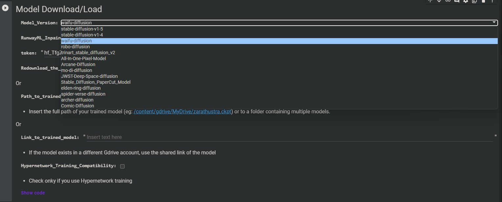

# Stable_Diffusion_Public_Models_Colab
<h1></h1> 
A Google colab for trying different public stable diffusion models and saving output images directly in google drive.
 
Colab adaptations from <a href="https://github.com/TheLastBen/fast-stable-diffusion">TheLastben</a> and <a href="https://github.com/AUTOMATIC1111/stable-diffusion-webui">AUTOMATIC1111</a>
 
 
This is a google colab notebook / jupyter notebook for utilizing different stable diffusion public models.
Stable Diffusion is a latent text-to-image diffusion model capable of generating photo-realistic images given any text input. For more details on stable diffusion visit <a href="https://huggingface.co/runwayml/stable-diffusion-v1-5">Huggingface</a>.
 
 
Steps to use this google colab:-
<ol>
<li> Click  to open the google colab notebook. Make sure that your are utilizing a GPU by checking if the settings are Runtime -> Change Runtime Type -> Select GPU from dropdown menu.</li>
<li> Go to the Model Download/Load section and select your choice of model to perform diffusion on and generate images.
</li>
<li> Click on Runtime -> Run all. This will run all cells.
</li>
<li> Colab will ask you to permit google drive acces click allow as this will help storing images in your drive. Choose which google account you want to store images in, and allow conditions as well.</li>
<li> Wait for around five minutes for model to AI model to load itself and for multiple dependencies/requirements to load as well.</li>
<li> Click on the the local URL link which will take you to a tunneling website , click tunnel to open AUTOMATIC1111's webui for stable diffusion.
</li>
<li> Enter Prompt in the prompt box and hit generate , wait for a few seconds and your image for that prompt will be generated. Enjoy!!!!.</li>
<li> Stop the Start-Stable-diffusion run box by clicking on the square inside circle spinning at top of code box in google colab notebook. </li>
 
There are many issues/errors in this colab/code please let me know if you encounter any issues while running the notebook.

